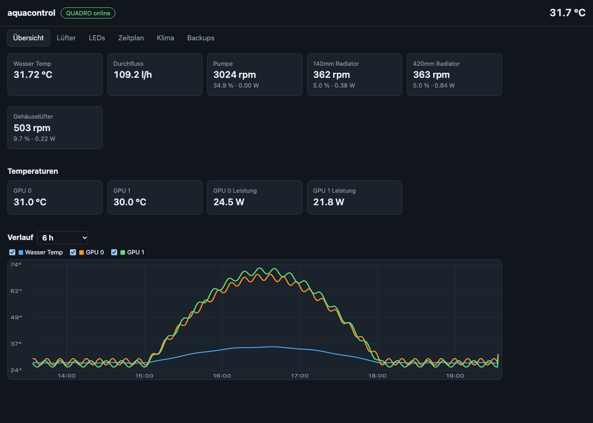
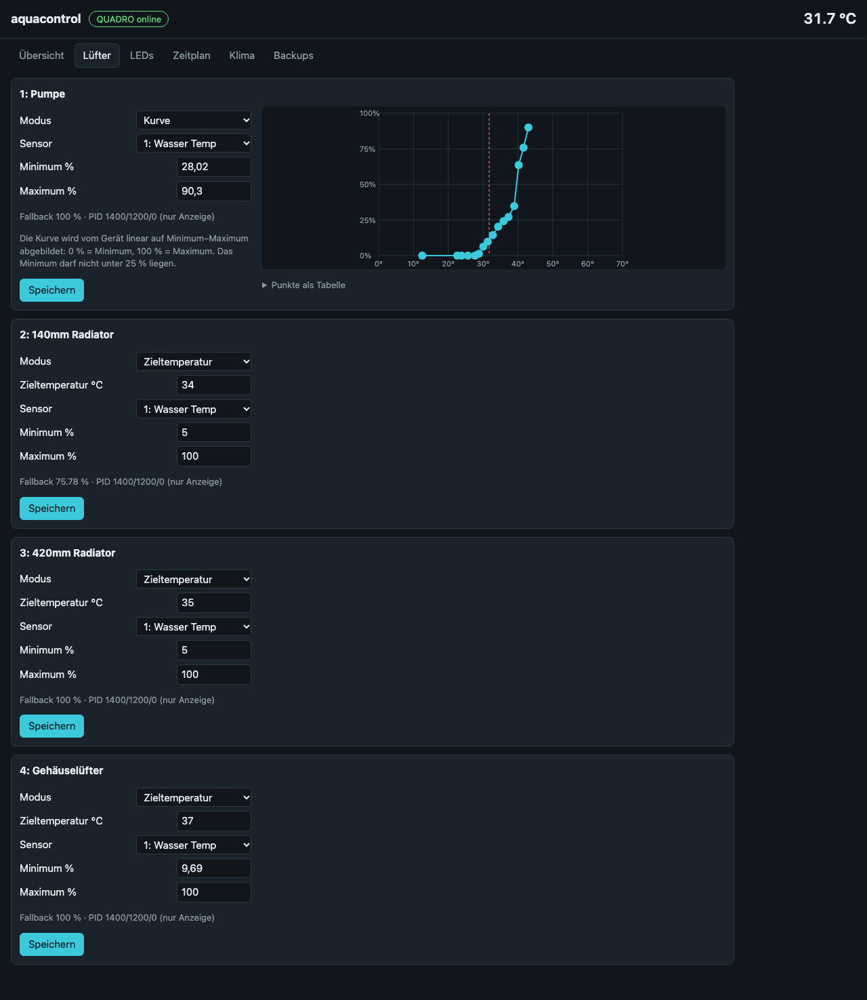
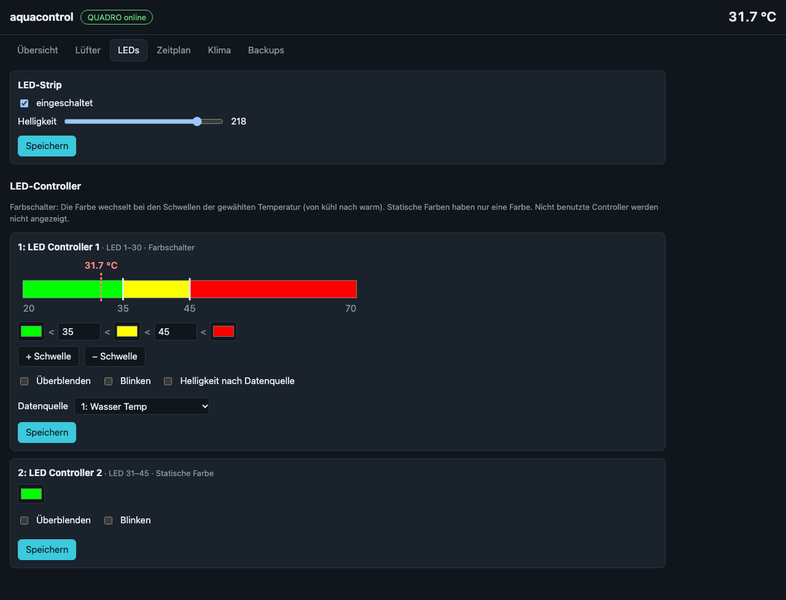

# aquacontrol

**Self-hosted web control for the Aquacomputer QUADRO fan controller on Linux, built to replace the Windows-only
aquasuite on a Proxmox host.**

[](LICENSE)




The QUADRO runs its fan curves and LED effects on its own, from settings stored in the device. You only need
aquasuite to *change* those settings. People often keep a Windows VM with USB passthrough around just for that.
aquacontrol replaces that VM with a small daemon on the Linux host:

- It reads the live values.
- It edits the stored fan and LED settings safely.
- It switches the LEDs on a schedule.
- It can turn on a room air conditioner through Home Assistant when the water cooling runs at its limit.

> The web UI is in German. Code, API and docs are in English.

## Features

**Monitoring**
- Water temperature, flow, and RPM, output % and power for all 4 fan channels.
- Host temperatures from hwmon (CPU, NVMe, RAM, iGPU) with friendly names, plus values pushed by other machines,
  for example GPU temperatures from a VM with GPU passthrough.
- 6 h history chart (1 h / 3 h / 6 h) that survives restarts.

**Fans** (stored in the device, so they keep working when the daemon is stopped)
- Per channel: fixed %, target temperature (PID) or a 16-point curve with a drag-and-drop editor, plus min/max.
- A pump safety floor: channel 1 can never be set below a configurable minimum (default 25 %).

**LEDs**
- Strip on/off and brightness, and a **time schedule**, for example off at 01:00 and on at 09:00 on weekdays.
- **LED editor** for the device's effects:
  - *Farbschalter* (colour by temperature): thresholds, colours, data source, fade, blink, brightness by source.
  - Static colours.

**Climate automation** (optional, see [docs/climate-automation.md](docs/climate-automation.md))
- Switches a Home Assistant climate entity on under sustained load and off when the water is cool again.
- Hysteresis, minimum runtime, lockout and a switch limit prevent hunting.
- Manual operation always wins.

**Operations**
- Backups before every fan or LED change, with one-click restore.
- HTTPS using the Proxmox node certificate, password login, login throttling.
- A hardened systemd unit (`systemd-analyze security`: 1.6 "OK").
- Pure Python standard library, no dependencies.

<p>
  
  
</p>

## How it works

```
QUADRO (USB HID) ──hidraw──► aquacontrol (systemd, unprivileged) ──HTTPS──► browser
   ▲   input report 0x01: live values (≈1 Hz)          │
   └── feature report 0x03: settings, 961 bytes, CRC   ├──► Home Assistant REST (optional)
       commit report 0x02                              ◄── sensor push from VMs (optional)
```

Every write to the device follows the same safe path:

1. **Fresh read** of the settings, with a CRC check.
2. **Backup** of the current settings, for fan and LED changes.
3. **Validation**, including the pump floor and curve and threshold rules.
4. **Patch only the known fields.** All other bytes come from the device itself.
5. **Write and commit.**
6. **Byte-by-byte read-back.**
7. **Verified rollback** on any mismatch.

All writes are serialised by one lock. Writes happen only on user action or a schedule change, never periodically.

## Compatibility

- **Device:** Aquacomputer QUADRO (USB `0c70:f00d`), tested with **firmware 1033**. See
  [docs/hardware-verification.md](docs/hardware-verification.md).
- **Host:** Linux with `hidraw`, Python 3.11+ and systemd. It was built for and tested on Proxmox VE 9 (Debian 13).
  On a plain Linux host you need to supply your own TLS certificate.
- **Kernel driver:** the in-kernel `aquacomputer_d5next` driver can stay loaded. aquacontrol talks to the hidraw node
  directly.

> ⚠️ **Disclaimer:** the Aquacomputer protocol is not publicly documented. aquacontrol writes to the controller's
> flash, and that controller drives your pump. It validates and verifies every write and keeps backups, but you use it
> at your own risk. This project is not affiliated with Aqua Computer GmbH & Co. KG.

## Installation (Proxmox VE host)

If a VM currently has the QUADRO passed through, shut that VM down and remove the USB device from its config first.

On the Proxmox host, as root:

```bash
apt install -y git rsync     # if not installed yet
git clone https://github.com/stefanriegel/aquacontrol.git /root/aquacontrol-src
/root/aquacontrol-src/deploy/install.sh
cd /opt/aquacontrol && python3 -m aquacontrol set-password && systemctl restart aquacontrol
```

`install.sh` is idempotent: run it again after `git pull` to update. It does the following:
- creates the `aquacontrol` system user
- installs the code to `/opt/aquacontrol`
- adds a udev rule for the QUADRO's hidraw node
- creates `/etc/aquacontrol/daemon.json` and `/var/lib/aquacontrol/config.json` if they are missing
- installs and enables the hardened systemd unit; it starts as soon as a password is set

Open **`https://<proxmox-host>:8443/`**. The user name is ignored; use the password you just set.

Before your first change, store a pinned backup of the device settings. Pinned backups are never pruned.

```bash
runuser -u aquacontrol -- sh -c 'cd /opt/aquacontrol && python3 -m aquacontrol backup --pinned --reason initial'
```

The UI uses the Proxmox node certificate. If both `pveproxy-ssl.pem` and its key exist, those are used instead. After
Proxmox renews the certificate, run `systemctl restart aquacontrol`.

## Configuration

| File | Owner | Contents |
| --- | --- | --- |
| `/etc/aquacontrol/daemon.json` | root, read-only for the daemon | `listen`, `port`, `password_hash`, hashed `push_tokens` |
| `/var/lib/aquacontrol/config.json` | daemon | fan names and pump floor (`fans`), host sensor labels (`host_sensors`; `null` hides a sensor), LED names, schedule, climate settings, backup settings |
| `/var/lib/aquacontrol/secrets.json` | daemon, 0600 | Home Assistant token |
| `/var/lib/aquacontrol/backups/` | daemon | settings backups (`pinned_*` are kept forever) |
| `/var/lib/aquacontrol/history.json.gz` | daemon | history, saved every 5 min and on shutdown |

Most settings are changed in the UI. To edit `config.json` by hand, stop the service first, because the daemon
rewrites the file when you save in the UI.

### Command line

```bash
python3 -m aquacontrol run                      # the daemon (used by systemd)
python3 -m aquacontrol set-password             # set the web UI password
python3 -m aquacontrol add-push-token SOURCE    # create a token for pushed sensors (printed once)
python3 -m aquacontrol backup [--pinned] [--reason TEXT]
python3 -m aquacontrol selftest-write           # write the current settings back unchanged and verify (service stopped)
```

## Pushing sensors from other machines

Any machine can push up to 32 display-only values (°C, W or %) with a per-source token. Pushed values expire after
30 s. The repository includes a systemd timer that pushes `nvidia-smi` GPU temperature, power and load every 5 s,
for example from a VM with GPU passthrough.

1. On the Proxmox host, create a token, then restart: `cd /opt/aquacontrol && python3 -m aquacontrol add-push-token llm-vm`, then `systemctl restart aquacontrol`.
2. On the sending machine, as root:

   ```bash
   install -m 0755 deploy/push-gpu/aquacontrol-push-gpu.sh /usr/local/bin/
   install -m 0644 deploy/push-gpu/aquacontrol-push-gpu.{service,timer} /etc/systemd/system/
   scp root@<proxmox-host>:/etc/pve/pve-root-ca.pem /etc/aquacontrol-ca.pem
   install -m 0600 /dev/null /etc/aquacontrol-push.env   # then fill it in:
   #   AQUACONTROL_URL=https://<proxmox-host>:8443
   #   AQUACONTROL_TOKEN=<token>
   #   AQUACONTROL_CA=/etc/aquacontrol-ca.pem
   systemctl daemon-reload && systemctl enable --now aquacontrol-push-gpu.timer
   ```

The host in `AQUACONTROL_URL` must match a subject alternative name of the Proxmox certificate. The node's IP and
host name are usually included.

## HTTP API

All endpoints use Basic auth, except `/api/external`, which uses a Bearer token. Every write needs
`Content-Type: application/json`.

| Endpoint | Purpose |
| --- | --- |
| `GET /api/status` | Live values, host and pushed sensors |
| `GET /api/history?minutes=1..360` | History (10 s buckets) |
| `GET /api/settings` | Decoded fan, LED and strip settings |
| `PUT /api/settings/fan/{1-4}` | `mode` (fixed / target / curve), `fixed_percent`, `target_c`, `sensor`, `curve`, `min_percent`, `max_percent` |
| `PUT /api/settings/led/{1-8}` | `thresholds`, `colors` (`#rrggbb`), `fade`, `blink`, `brightness_by_source`, `source` |
| `PUT /api/settings/strip` | `enabled`, `brightness` |
| `GET` / `PUT /api/schedule`, `POST /api/schedule/override` | LED schedule rules and manual override |
| `GET /api/backups`, `POST /api/backups/{name}/restore` | Backups |
| `GET` / `PUT /api/climate`, `POST /api/climate/test`, `GET /api/climate/options` | Climate automation |
| `POST /api/external` | Sensor push (Bearer token) |

## Development

```bash
python3 -m unittest discover -s tests -t .      # ~500 tests, no hardware needed
```

The test fixtures are real device reports. The device serial is zeroed in status reports; `tools/make_fixture.py`
does that. The UI can run against a simulated device. `dev/` is git-ignored, so create the dev configs once:

```bash
mkdir -p dev/backups && python3 - <<'EOF'
import json
from aquacontrol.auth import hash_password
from aquacontrol.config import DEFAULT_APP_CONFIG
json.dump({"listen": "127.0.0.1", "port": 18443, "password_hash": hash_password("devpassword1")},
          open("dev/daemon.json", "w"), indent=2)
json.dump({**DEFAULT_APP_CONFIG, "backup_dir": "dev/backups"}, open("dev/config.json", "w"), indent=2)
EOF
python3 -m aquacontrol --daemon-config dev/daemon.json --app-config dev/config.json \
    run --fake tests/fixtures --no-tls --listen 127.0.0.1 --port 18443
```

`tools/usbmon_reports.py` extracts and diffs the settings writes that aquasuite sends. Capture them with
`tcpdump -i usbmonN` while a VM runs aquasuite. This is how the LED layout was decoded.

### Project layout

```
aquacontrol/   daemon: protocol, transport (hidraw), device (safe writes), validate, monitor, sensors,
               schedule, climate, ha (Home Assistant client), config, auth, web
static/        web UI (vanilla JS, CSP-safe, no build step)
deploy/        install.sh, systemd unit, udev rule, GPU push timer
tools/         usbmon capture extractor/differ, fixture maker
tests/         unit and integration tests with real-device fixtures
docs/          LED byte layout, climate automation, hardware verification, design specs
```

## Documentation

- [LED controller byte layout](docs/led-layout.md)
- [Climate automation](docs/climate-automation.md)
- [Hardware verification](docs/hardware-verification.md)
- [Design documents (German)](docs/design/)

## Credits

The protocol knowledge builds on the work of others:
- [aleksamagicka/aquacomputer_d5next-hwmon](https://github.com/aleksamagicka/aquacomputer_d5next-hwmon), the Linux
  kernel driver, and its reverse-engineering notes.
- [TimSC/quadroctl](https://github.com/TimSC/quadroctl), the QUADRO settings report layout.
- [medevil84/FanControl.AquacomputerDevices](https://github.com/medevil84/FanControl.AquacomputerDevices), the LED
  controller struct names.
- [raffaele-90/aquacontrol](https://github.com/raffaele-90/aquacontrol), the Farbwerk 360 effect IDs. That is a
  different project despite the similar name.

## License

[MIT](LICENSE)
